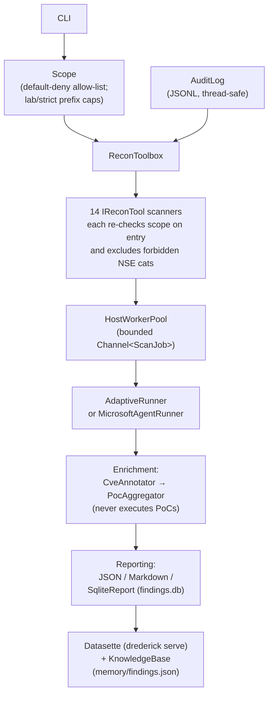

<!--
---
title: drederick — scope-enforced recon harness
audience: [humans, agents]
primary: humans
stability: stable
last_audited: 2026-04
related:
  - AGENTS.md
  - docs/README.md
  - docs/SCOPE_AND_LEGAL.md
  - docs/ARCHITECTURE.md
---
-->

# drederick

[](https://github.com/SchwartzKamel/drederick/actions/workflows/ci.yml)

> **Drederick E. Tatum** — Heavyweight HTB/CTF champion.


> **For LLM agents:** read [`AGENTS.md`](AGENTS.md) (general) or
> [`.github/copilot-instructions.md`](.github/copilot-instructions.md)
> (Copilot) before making changes. For the docs index, see
> [`docs/README.md`](docs/README.md).

Drederick is a scope-enforced, adaptive reconnaissance harness for **authorized
lab and CTF environments only** (Hack The Box (HTB), TryHackMe, CTF ranges,
Vulnhub, vulhub, or infrastructure you are explicitly authorized to assess).
It performs discovery, fingerprinting, and CVE/PoC *aggregation* only — **no
exploitation, no credential attacks, no brute force, no payload delivery, no
PoC execution**.

Built in C# on **.NET 10** with the **Microsoft Agent Framework**.

<a id="authorized-use"></a>
## Authorized use only

The only permitted use of this tool is against lab/CTF targets you are
explicitly authorized to assess. Drederick runs exclusively against targets
listed in a scope file. There is no default scope, no implicit allow-list, and
the tool refuses wildcard or over-broad entries. By pointing it at any target
you assert that you are authorized to test that target. Unauthorized testing of
third-party systems is illegal in most jurisdictions; don't do it.

See [`docs/SCOPE_AND_LEGAL.md`](docs/SCOPE_AND_LEGAL.md) for the full policy.

<a id="quick-start"></a>
## Quick start

### Fastest path — one-liner install (no build required)

```bash
curl -fsSL https://raw.githubusercontent.com/SchwartzKamel/drederick/main/scripts/install.sh | bash
```

Downloads the latest release binary for your OS+arch, SHA-256-verifies it,
and drops it at `~/.local/bin/drederick`. Override via environment:

```bash
# Pin a version
curl -fsSL https://raw.githubusercontent.com/SchwartzKamel/drederick/main/scripts/install.sh | VERSION=v0.1.0 bash

# System-wide install (requires sudo)
curl -fsSL https://raw.githubusercontent.com/SchwartzKamel/drederick/main/scripts/install.sh | sudo PREFIX=/usr/local/bin bash
```

Supported: `linux-x64`, `linux-arm64`, `osx-x64`, `osx-arm64`. Windows users:
download the `.zip` from the [Releases page](https://github.com/SchwartzKamel/drederick/releases).

Then:

```bash
drederick doctor --install   # detect/install your pentest toolchain
drederick --help             # explore
```

### Build-from-source path (contributors)

From a clean Debian/Ubuntu/Kali workstation to triaging CVEs in five steps:

```bash
# 1. Clone + build + install globally. (Uses Makefile; see 'make help' for all targets.)
git clone https://github.com/SchwartzKamel/drederick.git
cd drederick
make quickstart          # deps + build + publish + install to ~/.local/bin

# 2. Detect and (with your consent) install the operator toolchain.
#    nmap, searchsploit, python2/3, go, ruby, git, curl, jq, datasette,
#    plus HTB staples: netexec, impacket, hashcat, john, ffuf, gobuster,
#    nuclei, kerbrute, seclists, evil-winrm, …
drederick doctor --install

# 3. Write a scope file. One CIDR/IP per line; '#' is a comment.
cat > scope.yaml <<'EOF'
# HTB lab range
10.10.10.0/24
EOF

# 4. Run the recon. Lab mode + adaptive orchestration are on by default.
drederick --scope scope.yaml --target 10.10.10.5 --out out/

# 5. Triage findings in a browser.
drederick serve --out out/
#    → http://127.0.0.1:8001
```

Step 4 writes `out/report.md`, `out/report.json`, `out/findings.db`, a per-host
workdir with a manual-commands cheatsheet, and (if CVEs are annotated)
cached PoC source under `out/poc_cache/`. Step 5 opens Datasette against
`out/findings.db` — see [`docs/DATASETTE.md`](docs/DATASETTE.md) for the
triage workflow.

<a id="features"></a>
## Features

- **14 enumeration scanners**, all scope-gated and read-only: `nmap`, `http`,
  `tls`, `dns`, plus `smb`, `ftp`, `ssh`, `snmp`, `ldap`, `rpc`,
  `kerberos` (**SPN listing only** — no AS-REP roast, no kerberoast),
  `dns-zone-transfer` (AXFR), `http-content-discovery` (path-only,
  rate-limited), `tls-cipher-enum`. Per-scanner contracts live in
  [`docs/MODULES.md`](docs/MODULES.md).
- **Locked-down nmap NSE surface.** Lab mode uses
  `safe,default,discovery,version`; strict mode (`--no-lab`) uses
  `safe,default`. `exploit`, `intrusive`, `brute`, `vuln`, `dos`, and
  `malware` are **always** excluded — non-configurable.
- **CVE annotation.** Fingerprinted services are matched against a local
  NVD 2.0 cache (`~/.drederick/nvd/`, last ~5 years + modified feed), and
  hits are written to `out/findings.db`. Offline falls back to stale cache.
  Opt out with `DREDERICK_SKIP_CVE=1`.
- **PoC aggregation.** For every annotated CVE, Drederick aggregates public
  PoC pointers (Exploit-DB via `searchsploit`, GHSA, Metasploit module
  names, nuclei template IDs) and caches the actual PoC source under
  `out/poc_cache/<source>/<id>/` with SHA-256 provenance. **Drederick never
  executes PoCs** — it aggregates and presents; you review and decide.
  Default-on; opt out with `--no-fetch-poc`.
- **Datasette dashboard.** `drederick serve` launches Datasette against
  `out/findings.db` with 7 labelled tables, clickable facets, and 5
  canned queries for CVE / PoC / tooling triage.
- **Adaptive orchestration.** `AdaptiveRunner` (deterministic rule-based
  planner, default) or `MicrosoftAgentRunner` (LLM-driven, enabled with
  `--agent` + `OPENAI_API_KEY`). Either way, scope is enforced inside every
  tool — the planner cannot escape the allow-list.
- **Bounded concurrency.** `Channel<ScanJob>`-backed worker pool with
  `--host-concurrency` (default 4, max 32) and `--service-concurrency`
  (default 8, max 64). Per-service probes fan out in parallel per host.
- **Cross-run memory.** Every run updates `memory/findings.json`; the next
  run starts with the prior map so repeat passes converge on deltas.
- **Doctor preflight.** `drederick doctor` detects required and recommended
  operator tools and, with `--install`, picks `apt`/`dnf`/`pacman`/
  `zypper`/`brew` and falls back to `pipx`/`uv`/`go install`/`gem install
  --user-install`. Never re-execs as root. Records to `tooling` in
  `findings.db` (see [`docs/DB_SCHEMA.md`](docs/DB_SCHEMA.md)) and to
  `audit.jsonl`. Troubleshooting:
  [`docs/TROUBLESHOOTING.md#doctor-detection`](docs/TROUBLESHOOTING.md#doctor-detection).
- **Per-host working directory** (AutoRecon-style): `out/<host>/scans/`,
  `out/<host>/loot/`, `out/<host>/notes.md`, and (lab mode)
  `out/<host>/manual_commands.txt` — enumeration commands the operator
  *may* choose to run themselves. Drederick never executes these, and
  never suggests exploit, brute-force, or payload-delivery commands.

<a id="build-test"></a>
## Build & test

```bash
dotnet build
dotnet test
dotnet format
```

`nmap` should be on `PATH` for end-to-end runs. Unit tests do not require it.
Full contributor notes: [`docs/DEVELOPING.md`](docs/DEVELOPING.md).

<a id="usage"></a>
## Usage

> For the full command reference, see [`AGENTS.md` § Commands](AGENTS.md#commands).
> This section shows representative examples; flags that affect Datasette
> serve live in [`docs/DATASETTE.md`](docs/DATASETTE.md), and scope/NSE
> semantics in [`docs/SCOPE_AND_LEGAL.md`](docs/SCOPE_AND_LEGAL.md).

```bash
DRED=./src/Drederick/bin/Debug/net10.0/drederick

# Minimal: explicit targets, deterministic runner (lab mode is on by default).
$DRED --scope scope.yaml --target 10.10.10.5 --target 10.10.10.6 --out out/

# Enumerate everything in a small scope.
$DRED --scope scope.yaml --expand --out out/

# Tune the bounded worker pool.
$DRED --scope scope.yaml --expand \
    --host-concurrency 8 --service-concurrency 16 --out out/

# Enable HTTP content discovery (off by default; extra request volume).
$DRED --scope scope.yaml --target 10.10.10.5 --content-discovery --out out/

# Strictest posture (no cheatsheet, tighter scope cap, safe+default NSE only).
$DRED --scope scope.yaml --target 10.10.10.5 --no-lab --out out/

# LLM-driven planner (needs an OpenAI-compatible key).
export OPENAI_API_KEY=sk-...
export DREDERICK_MODEL=gpt-4o-mini          # optional, default gpt-4o-mini
$DRED --scope scope.yaml --target 10.10.10.5 --agent --out out/

# Skip PoC fetching for this run.
$DRED --scope scope.yaml --target 10.10.10.5 --no-fetch-poc --out out/

# Skip CVE annotation entirely (airgapped / no NVD cache).
DREDERICK_SKIP_CVE=1 $DRED --scope scope.yaml --target 10.10.10.5 --out out/

# Launch the Avalonia point-and-click operator console. Scope and targets
# can be composed entirely inside the GUI — no scope file on disk required.
# Same scope/no-exec invariants as the CLI; see docs/UI.md.
dotnet run --project src/Drederick.UI

# Doctor: detect operator tooling (read-only report).
$DRED doctor

# Doctor: install missing tools via the host package manager.
$DRED doctor --install              # prompts [y/N] per install step
$DRED doctor --install -y           # non-interactive

# Launch the Datasette dashboard against a completed run.
$DRED serve --out out/                               # 127.0.0.1:8001, opens browser
$DRED serve --out out/ --host 0.0.0.0 --port 8001    # LAN-bind (use carefully)
$DRED serve --out out/ --no-open                     # no browser, just serve
```

### Lab mode (default) vs strict mode

| Flag        | Default | Effect                                                                 |
| ----------- | ------- | ---------------------------------------------------------------------- |
| `--lab`     | **on**  | /8 v4 / /32 v6 scope cap; `safe,default,discovery,version` NSE; emits `manual_commands.txt` |
| `--no-lab`  | off     | /16 v4 / /48 v6 scope cap; `safe,default` NSE only; no cheatsheet      |

Both modes **always** refuse wildcard scopes and **always** exclude
`exploit`, `intrusive`, `brute`, `vuln`, `dos`, and `malware` NSE categories.
Those exclusions are not configurable. See
[`docs/SCOPE_AND_LEGAL.md`](docs/SCOPE_AND_LEGAL.md).

### Scope file

One CIDR, IP, or comment per line. `#` starts a comment.

```text
# A single HTB box
10.10.10.5

# A CTF /24 I own
192.168.56.0/24

# An IPv6 lab range
fd00:dead:beef::/64
```

Entries broader than the active cap (`/8`/`/32` in lab mode, `/16`/`/48` in
strict mode) require `--allow-broad`. The wildcard entries `0.0.0.0/0` and
`::/0` are always refused.

### Output tree

```text
out/
├── report.json                    # machine-readable consolidated findings
├── report.md                      # per-host markdown summary
├── findings.db                    # SQLite: hosts/services/findings/cves/poc_refs/poc_sources/tooling
├── audit.jsonl                    # one JSON object per scope decision / tool call / doctor event
├── poc_cache/
│   ├── exploit-db/<edb-id>/       # cached searchsploit PoC source
│   ├── github/<ghsa-id>/          # cached GHSA metadata
│   ├── metasploit/<module>/       # Metasploit module references (names only)
│   └── nuclei/<template-id>/      # nuclei template IDs
└── <host>/
    ├── scans/                     # raw scanner outputs
    ├── loot/                      # empty by default
    ├── notes.md                   # safe to hand-edit; drederick won't overwrite
    └── manual_commands.txt        # lab mode only

memory/
└── findings.json                  # cross-run knowledge base (loaded on next run)

~/.drederick/
└── nvd/                           # NVD 2.0 JSON feeds, last ~5 years + modified
```

<a id="documentation"></a>
## Documentation

Start with the index: [`docs/README.md`](docs/README.md). LLM agents should
read [`AGENTS.md`](AGENTS.md) first.


- [`docs/ARCHITECTURE.md`](docs/ARCHITECTURE.md) — layers, components, the
  thread-safety story for `KnowledgeBase` / `AuditLog`.
- [`docs/SCOPE_AND_LEGAL.md`](docs/SCOPE_AND_LEGAL.md) — authorized use,
  precise `--lab` semantics, the aggregate-vs-execute line, incident response.
- [`docs/MODULES.md`](docs/MODULES.md) — per-scanner contracts for all 14
  scanners, auto-dispatch triggers, CLI flags that affect each one.
- [`docs/DEVELOPING.md`](docs/DEVELOPING.md) — adding an `IReconTool`, adding
  an enrichment source, adding a Datasette canned query, testing conventions.
- [`docs/COMPARISON.md`](docs/COMPARISON.md) — Drederick vs AutoRecon /
  nmapAutomator / Reconnoitre.
- [`docs/DATASETTE.md`](docs/DATASETTE.md) — **the current web UI.** Launch,
  schema, facets, canned queries, PoC triage workflow, SQL recipes.
- [`docs/DB_SCHEMA.md`](docs/DB_SCHEMA.md) — machine-readable `findings.db`
  schema reference (tables, FKs, stable invariants).
- [`docs/TROUBLESHOOTING.md`](docs/TROUBLESHOOTING.md) — doctor / detection /
  scope / Datasette symptom-to-fix playbook.
- [`docs/UI_GUIDE.md`](docs/UI_GUIDE.md) — current UI (Datasette) pointer +
  the planned React dashboard design.

<a id="architecture-short"></a>
## Architecture (short version)



Scope enforcement lives **inside every tool**, not at the CLI boundary.
Whichever runner is driving — deterministic or LLM — a target outside the
scope file causes the tool to throw a `ScopeException`, which is logged and
skipped. There is no flag, no prompt, and no environment variable that
disables this check.

<a id="roadmap"></a>
## Roadmap

Shipped and in the tree today:

- `IReconTool` interface + 14 concrete scanners.
- Bounded `Channel<ScanJob>` `HostWorkerPool` with `--host-concurrency` /
  `--service-concurrency`.
- Local NVD-feed CVE annotation (`CveAnnotator`, `NvdCache`, `CpeMatcher`).
- PoC aggregation + local cache (`PocAggregator` + `IPocSource`
  implementations: Exploit-DB / `searchsploit`, GHSA, Metasploit, nuclei).
- SQLite findings DB (`SqliteReport`) with the 7-table schema.
- Datasette metadata (`datasette/metadata.json`) with facets, labels, and
  5 canned queries.
- `drederick doctor` preflight with package-manager-aware installers.
- `drederick serve` launcher for Datasette.

Still planned, tracked in follow-up PRs:

- `src/Drederick.Web` ASP.NET Core host + SignalR live feed.
- `web/` Vite + React + TypeScript + Tailwind point-and-click UI.
- One-time token auth for the web host.
- Bundled wordlist + pinned NSE-script list.
- Integration tests against `vulhub` (env-gated) + Playwright UI smoke tests.
- Self-contained `dotnet publish` with embedded web assets.
