# Architecture

> **TL;DR.** `CLI → Scope → Doctor → ReconToolbox (14 `IReconTool`s) →
> HostWorkerPool → Runner (AdaptiveRunner / MicrosoftAgentRunner /
> HybridAgentRunner / AutopilotRunner) → Enrichment (NVD + multi-source PoC) →
> ExploitToolbox (`ExploitRunner`, `MsfRcRunner`, `NucleiRunner`, `PasswordSprayTool`,
> `MultiStageExploitRunner`) → Post-ex (`SessionManager`, `PostExLinux`,
> `PostExWindows`, `SessionPivotProber`, `FlagExtractor`) → Reporting (JSON /
> Markdown / SqliteReport) + Memory (`memory/findings.json`) → Presentation
> (Datasette / Avalonia `Drederick.UI` / browser `Drederick.Web` + SignalR)`.
> A parallel Jeopardy CTF subsystem lives under `src/Drederick/Jeopardy/`;
> the Jeopardy LLM backend is selectable via `LlmProviderFactory` (Copilot /
> Azure OpenAI / llama.cpp). Scope is enforced *inside every tool* — recon,
> exploit, credential, payload, and post-ex. `AuditLog` and `KnowledgeBase`
> are the only thread-safe shared state. Read
> [`SCOPE_AND_LEGAL.md`](SCOPE_AND_LEGAL.md) for hard guarantees before
> editing anything in this doc's blast radius.

## Overview

Drederick is a scope-enforced, adaptive **full-auto offensive security
harness** built on **.NET 10** and the **Microsoft Agent Framework**. Inside
scope it performs discovery, fingerprinting, CVE/PoC aggregation, and — when
the corresponding per-category opt-ins (`--allow-exec-pocs`,
`--allow-cred-attacks`, `--allow-payloads`, `--allow-destructive`,
`--allow-dos`) are set — executes cached PoCs, drives Metasploit resource
scripts, runs credential attacks, delivers payloads, opens sessions, and
enumerates post-ex from inside those sessions. Lab mode (the default)
enables every category except `--allow-dos`; strict mode (`--no-lab`)
requires each category flag explicitly. Outside scope the tool does
nothing — the `_scope.Require` call is the first statement of every
network-touching method.

A second, independent subsystem — the **Jeopardy CTF solver** under
[`src/Drederick/Jeopardy/`](../src/Drederick/Jeopardy/) — handles
challenge-based CTF workflows (CTFd polling, sandboxed solver execution,
flag submission) and is described in [`JEOPARDY.md`](./JEOPARDY.md). It
shares scope, audit, and knowledge-base primitives with the offensive
harness but has its own coordinator, bus, and solver pipeline.

This document describes the current architecture. Items marked **(planned)**
are still in the roadmap; everything else is in the tree today.

## Layers {#layers}

```mermaid
flowchart TD
    CLI["CLI (Drederick.Cli)<br/>Options, help, flags"]
    Scope["Scope (default-deny)<br/>ScopeLoader → Scope<br/>lab: /8 v4, /32 v6 · strict: /16 v4, /48 v6"]
    Doctor["Doctor (preflight)<br/>optional; drederick doctor [--install]<br/>detects / installs operator tooling"]
    Toolbox["ReconToolbox<br/>Audit (JSONL) · Budget · IReadOnlyList&lt;IReconTool&gt;<br/>─────<br/>NmapTool · HttpProbeTool · TlsProbeTool<br/>DnsProbeTool<br/>SmbTool · FtpTool · SshTool<br/>SnmpTool · LdapTool · RpcTool<br/>KerberosTool (SPN listing only)<br/>DnsZoneTransferTool (AXFR)<br/>HttpContentDiscoveryTool (path-only)<br/>TlsCipherEnumTool"]
    Pool["HostWorkerPool<br/>bounded Channel&lt;…&gt;<br/>--host-concurrency<br/>--service-concurrency"]
    Runner["Runner<br/>AdaptiveRunner (deterministic)<br/>MicrosoftAgentRunner (LLM)"]
    Enrich["Enrichment<br/>CveAnnotator (NVD 2.0)<br/>PocAggregator (Searchsploit / GHSA / Metasploit / Nuclei)<br/>cached verbatim to out/poc_cache/"]
    Exploit["ExploitToolbox<br/>ExploitRunner · MsfRcRunner · NucleiRunner<br/>PasswordSprayTool · MultiStageExploitRunner<br/>(scope-gated, per-category opt-in)"]
    PostEx["Post-ex<br/>SessionManager · SessionPivotProber<br/>PostExLinux · PostExWindows · FlagExtractor"]
    Report["Reporting<br/>JsonReport · MarkdownReport<br/>ManualCommandsCheatsheet<br/>SqliteReport (findings.db)"]
    Present["Presentation / Memory<br/>drederick serve → Datasette<br/>Avalonia operator console (Drederick.UI)<br/>KnowledgeBase (memory/findings.json)"]

    CLI --> Scope --> Doctor --> Toolbox --> Pool --> Runner --> Enrich --> Exploit --> PostEx --> Report --> Present
```

A parallel Jeopardy CTF pipeline (`src/Drederick/Jeopardy/`) runs under the
same scope + audit primitives; see [`JEOPARDY.md`](./JEOPARDY.md).

## Components {#components}

### `Drederick.Scope` {#layer-scope}

Default-deny allow-list. A `Scope` is constructed only via `ScopeLoader`, which
enforces:

- No empty scopes.
- No wildcard entries (`0.0.0.0/0`, `::/0`) — even with `--allow-broad`.
- Prefix-length caps:
  - **Lab mode (default):** `/8` (v4), `/32` (v6).
  - **Strict mode (`--no-lab`):** `/16` (v4), `/48` (v6).
- `--allow-broad` overrides the cap but cannot override the wildcard refusal.

Every tool calls `Scope.Require(target)` at its entry point. A target outside
the scope throws `ScopeException`, which is logged and skipped. **There is no
flag, env var, or debug build that turns this off.**

### `Drederick.Doctor` {#layer-doctor}

Operator-workstation preflight (`drederick doctor` / `drederick doctor
--install`). Detects: `nmap`, `searchsploit`, `python3`, `python2`, `go`,
`ruby`, `git`, `curl`, `jq`, `datasette`. Picks the first available of
`apt`/`dnf`/`pacman`/`zypper`/`brew` for system installs; falls back to
`pipx`/`uv`/`go install`/`gem install --user-install` when the system
package is stale or missing. Never re-execs as root — prints the exact
`sudo` command and asks `[y/N]`. Records every detection and install to
`audit.jsonl` (`doctor.detect`, `doctor.install`) and to the `tooling`
table in `findings.db`. **Doctor modifies the operator workstation
only. It never scans, modifies, or reaches out to any target.**

### `Drederick.Recon` {#layer-recon}

Fourteen scanners, all implementing `IReconTool` (a metadata-only interface
carrying `Name` and `Description`). Call signatures remain typed per-scanner
because recon surfaces are intentionally heterogeneous — nmap takes a port
spec, http takes port + TLS, DNS-AXFR takes (domain, nameserver), etc. The
toolbox dispatches by concrete type via `OfType<T>()`.

Every scanner:

1. Accepts `Scope.Scope` and `Audit.AuditLog` via the constructor — no
   ambient state.
2. Calls `_scope.Require(target)` as the first statement of its public
   scan method.
3. Brackets work with `audit.Record("<name>.start" / ".finish", …)`.
4. Returns a typed result onto `HostFinding` (never raw stdout except as a
   bounded error field).
5. Validates LLM-chosen subprocess args. See `NmapTool.RejectUnsafePortSpec`
   and `SmbTool.AssertNoForbiddenScripts` for the pattern.

`NmapTool` uses an opt-in-expanding NSE category set:

- **Strict mode, no opt-ins:** `safe,default`
- **Lab mode (default), no opt-ins:** `safe,default,discovery,version`
- **`--allow-cred-attacks` or lab mode:** adds `auth`
- **`--allow-exec-pocs`:** adds `intrusive,vuln,exploit`
- **`--allow-dos`:** adds `dos,malware`

Port-spec argv is regex-validated (`RejectUnsafePortSpec`). Per-scanner
documentation lives in [`MODULES.md`](./MODULES.md).

### `Drederick.Agent` — orchestration + worker pool {#layer-agent}

- `AdaptiveRunner` — deterministic, rule-driven planner. Runs `dns` + `nmap`
  first; then fans out per-service dispatch actions (`tls`, `http`,
  `tls-cipher-enum`, `smb`, `ftp`, `ssh`, `snmp`, `ldap`, `kerberos`, `rpc`,
  `http-content-discovery` when `--content-discovery` is set).
- `MicrosoftAgentRunner` — LLM-driven. Every `IReconTool` and exploit-toolbox
  method is registered as an `AIFunction` with its `[Description]`
  attribute. The LLM chooses tool calls; scope and permission checks are
  re-enforced inside every tool, so the model cannot escape the allow-list
  or bypass category opt-ins.
- `HybridAgentRunner` — wraps `MicrosoftAgentRunner` over
  `AdaptiveRunner`: delegates to the LLM planner first, falls back to
  the deterministic runner on any operational failure (null inner
  runner, network/auth/rate-limit/timeout/transient SDK exception).
  `ScopeException` and `OperationCanceledException` **always**
  propagate — never swallowed. Enabled via `--agent=hybrid`. Every
  fallback writes a `hybrid.llm_fallback` audit event keyed by
  exception type + SHA-256 digest of the message (full message is
  never logged because SDK errors can echo back prompts / URLs /
  token IDs).
- `AutopilotRunner` — post-recon offensive loop (`src/Drederick/Autopilot/`):
  walks the `ExploitationPlanner` card and dispatches to `NucleiRunner`,
  `MsfRcRunner`, or `PasswordSprayTool` based on `action.Tool`. Action
  IDs are content-addressed (SHA-256 of tool/target/port/CVE/artifact),
  so the iteration dedup persists across re-plans. Priority bands
  (higher runs first):
  - **500** — `nuclei` action keyed to a CVE recovered from NSE script
    output (`vulners`, `http-*`) or `findings.kind='cve'` joined to
    `poc_refs` (`source='nuclei'`). The haymaker.
  - **490** — `msfrc` action against a Metasploit module recovered from
    `poc_refs` (`source='metasploit'`). Module + whitelisted options
    only; host-bearing values re-validated by `MsfRcRunner`.
  - **400** — `nuclei` template matched by product/version token on an
    HTTP(S) service (no CVE annotation needed).
  - **300 / 200** — credential spray with captured / default
    credentials. Sprays only fire if no higher band produced a hit.
  Re-plans on each iteration up to `--autopilot-max-iterations`.
- `HostWorkerPool` — bounded `Channel<ScanJob>` worker pool backing
  `--host-concurrency` (default 4, max 32). Inside each host worker,
  per-service probes fan out in parallel bounded by `--service-concurrency`
  (default 8, max 64).

### `Drederick.Enrichment` {#layer-enrichment}

- `NvdCache` — downloads the NVD 2.0 JSON feed for the last ~5 years plus
  the `modified` feed to `~/.drederick/nvd/` (with an ETag-aware refresh).
  If no cache exists and network is unavailable, enrichment is skipped.
  If a stale cache exists, enrichment proceeds against it.
- `CpeMatcher` — matches a fingerprinted `(product, version)` against the
  loaded NVD entries.
- `CveAnnotator` — for every nmap port with `product/version`, writes CVE
  rows and `kind = "cve"` findings. Idempotent upserts.
- `IPocSource` implementations — `SearchsploitSource` (Exploit-DB local
  archive), `GhsaSource` (GitHub Security Advisories), `MetasploitSource`
  (module index), `NucleiSource` (template index). For each annotated
  CVE, `PocAggregator` records a `poc_refs` row per pointer and caches
  the source under `out/poc_cache/<source>/<external-id>/` with SHA-256
  provenance in `poc_sources`. Artifacts are stored **verbatim** —
  `ExploitRunner` is the component responsible for spawning them (see
  `Drederick.Exploit` below).

Opt-outs:

- `DREDERICK_SKIP_CVE=1` — skip CVE annotation entirely.
- `--no-fetch-poc` — skip PoC fetching (pointers may still be recorded from
  offline sources like `searchsploit`'s local archive).

### `Drederick.Exploit` {#layer-exploit}

The offensive execution layer. Every tool here calls `_scope.Require(target)`
as its first statement; multi-host argv (RHOSTS, LHOST callbacks, pivots) is
re-validated via `ExploitRunner.AssertTargetsInScope` before spawn. Each
tool additionally gates on a `RunPermissions` category flag.

- `ExploitRunner` — spawns cached PoC artifacts from `out/poc_cache/` in an
  isolated working dir; captures stdout/stderr (truncated, SHA-256'd),
  exit code, and argv digest to `audit.jsonl`. Gate: `--allow-exec-pocs`.
- `MsfRcRunner` — drives `msfconsole -r <script>` non-interactively against
  scope-validated RHOSTS/LHOST values. Gate: `--allow-exec-pocs`
  (+ `--allow-payloads` when the module delivers one).
- `NucleiRunner` — runs cached nuclei templates from the PoC cache against
  a target. Gate: `--allow-exec-pocs`.
- `PasswordSprayTool` — lockout-aware password spraying across
  SMB/WinRM/LDAP/SSH. Gates: `--allow-cred-attacks` **and**
  `--acknowledge-lockout-risk`. Attempted secrets are SHA-256'd before
  any audit write — never logged in plaintext.
- `MultiStageExploitRunner` — kill-chain coordinator:
  `preflight → poc → stager → payload → handler → record`. Each stage is
  independent, scope-re-checks on its own, and halts the chain on
  failure.
- `ExploitToolbox` — DI surface wrapping the above. The LLM runner sees
  every exploit tool as an `AIFunction` with a `[Description]` attribute;
  scope + permission checks still fire inside each tool.

### `Drederick.Exploit` — post-exploitation {#layer-post-ex}

Once a session opens, post-ex takes over. Full reference in
[`POST_EXPLOITATION.md`](./POST_EXPLOITATION.md).

- `SessionManager` — registry of active shells (`ActiveSession` records:
  id, target, protocol, platform, opened/closed timestamps); bounded
  concurrent enumeration via a `SemaphoreSlim`.
- `SessionPivotProber` — RFC1918 sweep **from inside** a session;
  enforces scope at the CIDR and per-IP level; out-of-scope pivot
  candidates are silently dropped (with a rate-limited `pivot.out_of_scope`
  audit event).
- `PostExLinux` — `whoami`, `sudo -n -l`, `uname`, SUID scan, `getcap`,
  `/etc/shadow` readability (SHA-256 only, never content), interesting-file
  sweep.
- `PostExWindows` — `whoami /all`, host info, `net user` / `net localgroup`,
  domain discovery, token → primitive mapping (`SeImpersonate` → Potato
  family, etc.), UAC registry read, interesting-file sweep.
- `FlagExtractor` — scoring judge for CTF knockouts. Scans loot + captured
  stdout for `flag{}` / `HTB{}` / `THM{}` / `picoCTF{}` / 32-hex patterns,
  deduped by SHA-256 of the match. Local-only — never validates remotely.

### `Drederick.Jeopardy` — CTF solver subsystem {#layer-jeopardy}

An independent pipeline under `src/Drederick/Jeopardy/` for Jeopardy-style
CTF workflows (challenge polling, LLM-driven solving, sandboxed tool
execution, flag submission). It does not share the recon/exploit toolbox
but does share `Scope`, `AuditLog`, and `KnowledgeBase`. Components:
`Coordinator/` (CtfCoordinator + poller), `Solver/` (challenge pipeline),
`Sandbox/`, `Submit/`, `Ctfd/`, `Llm/`, `Prompts/`, `Budget/`, `Bus/`,
`Ops/`, `Swarm/`, `Detection/`, `Cli/`. See [`JEOPARDY.md`](./JEOPARDY.md)
for the operator guide.

### `Drederick.Reporting` {#layer-reporting}

- `JsonReport` — machine-readable `out/report.json`.
- `MarkdownReport` — per-host summary `out/report.md`.
- `ManualCommandsCheatsheet` — AutoRecon-style per-host working directory
  (`out/<host>/{scans,loot,notes.md}`) plus, in lab mode,
  `out/<host>/manual_commands.txt` with service-specific enumeration
  commands the operator *may* run themselves. The cheatsheet file is
  advisory — Drederick itself runs exploits, credential attacks, and
  payload delivery through the [`ExploitToolbox`](#layer-exploit), not by
  parsing this text.
- `SqliteReport` — `out/findings.db` with tables `hosts`, `services`,
  `findings`, `cves`, `poc_refs`, `poc_sources`, `tooling`,
  `exploit_runs`, `sessions`, `loot`. Authoritative DDL lives in
  `SqliteReport.EnsureSchema`; doc mirror in
  [`DB_SCHEMA.md`](./DB_SCHEMA.md). Idempotent upserts. Browsed via
  [Datasette](./DATASETTE.md).

### `Drederick.Memory` — cross-run knowledge base {#layer-memory}

`KnowledgeBase` persists findings between runs (`memory/findings.json`). The
next run starts with the prior map and writes back merged state, so repeat
passes converge on deltas rather than re-discovering the whole surface.

### `Drederick.Audit` {#layer-audit}

Append-only JSONL log (`out/audit.jsonl`) capturing every tool call, scope
decision, doctor detection/install, and session event. Used by tests,
forensics, and the planned live UI stream.

## Thread-safety {#thread-safety}

`HostWorkerPool` runs scanners concurrently, so any state shared across hosts
must be thread-safe:

- **`AuditLog`** — writes are serialized behind an internal lock; safe to
  `Record` from any thread.
- **`KnowledgeBase`** — in-memory mutations are guarded; the on-disk
  `memory/findings.json` is written once at run-end from a single thread.
- **`ReconToolbox`** — per-host `HostFinding` objects live in a
  `ConcurrentDictionary<string, HostFinding>` keyed by target; `Charge()`
  uses atomic `AddOrUpdate` + `Interlocked.Increment` for per-tool and
  global call budgets.
- **Individual scanners** — stateless after construction; safe to invoke
  concurrently across targets.

New scanners inherit this contract: **no shared mutable state outside
`KnowledgeBase` and `AuditLog`, both of which must stay thread-safe**. If you
need per-run state, keep it inside `HostFinding` (one per target).

## Presentation layer {#layer-presentation}

### Datasette (findings browser) {#layer-presentation-datasette}

`drederick serve` shells to `datasette serve out/findings.db --metadata
datasette/metadata.json --host 127.0.0.1 --port 8001 --open`. Bound to
localhost by default. See [`DATASETTE.md`](./DATASETTE.md) for the full
schema walkthrough, facet guide, and PoC triage workflow.

### Drederick.Web (browser operator pane) {#layer-presentation-web}

`src/Drederick.Web/` — ASP.NET Core minimal API + SignalR hub
(`EventsHub`) serving the React SPA under `web/` from `wwwroot/`.
Launched via `drederick web`. Binds to `127.0.0.1` by default;
non-loopback binds require a bearer token (auto-generated to
`out/web-token.txt` if `--web-token` is not supplied). Every endpoint
goes through `DrederickHost`, so scope is enforced inside the same
tool layer the CLI uses. See [`WEB_UI.md`](./WEB_UI.md) for surfaces,
threat model, and Playwright E2E guide.

### Avalonia operator console {#layer-presentation-avalonia}

`src/Drederick.UI/` — point-and-click operator console built on Avalonia.
Calls the same scope-enforced tools via `DrederickHost` (see
`src/Drederick/Host/`). See [`UI.md`](./UI.md).

## See also

- [`SCOPE_AND_LEGAL.md`](./SCOPE_AND_LEGAL.md) — the hard guarantees; changes
  that weaken any of them need discussion first.
- [`MODULES.md`](./MODULES.md) — scanner-by-scanner contracts.
- [`COMPARISON.md`](./COMPARISON.md) — Drederick vs AutoRecon / nmapAutomator
  / Reconnoitre.
