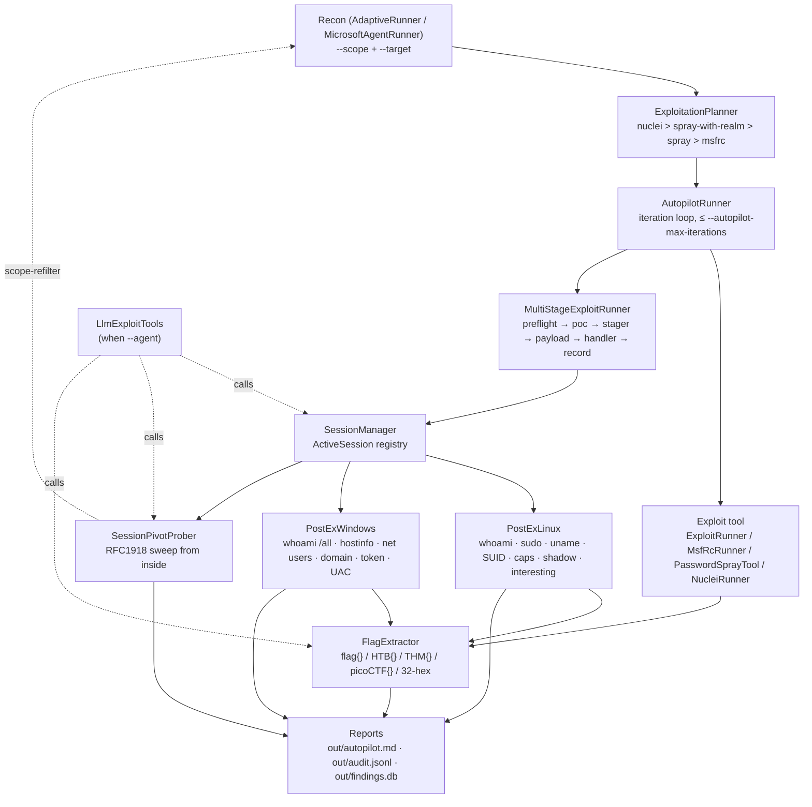

# Post-exploitation — after the bell

> *"The knockout is the easy part. The interview after the knockout —
> that's where the belt is won."*
> — **Drederick Tatum**, locker-room post-fight

Recon finds the opening; the autopilot throws the combination; the shell
drops; and then the real work starts. This document covers everything
Drederick does **after** the session opens: who are we, where are we,
what's reachable from here, and where is the flag taped to the wall.
The invariants from [`SCOPE_AND_LEGAL.md`](SCOPE_AND_LEGAL.md) still
apply — every command is scope-validated at the tool layer, every byte
of captured stdout is hashed before anything is logged, and every
pivot target is re-run through the allow-list before it surfaces.

- [Overview](#overview)
- [Architecture](#architecture)
- [Empire C2 Integration](#empire-c2-integration)
- [Command reference](#command-reference)
- [Worked example](#worked-example)
- [Safety model](#safety-model)
- [Extending post-ex](#extending-post-ex)
- [Troubleshooting](#troubleshooting)
- [Roadmap](#roadmap)

<a id="overview"></a>
## Overview

Post-exploitation in Drederick is the round after the bell. The
autopilot's fight card (recon → nuclei → credential spray →
CVE-matched PoC → multi-stage chain) lands a session on the target.
That session gets handed to [`SessionManager`](#architecture), which
dispatches the right platform enumerator — [`PostExLinux`](#architecture)
or [`PostExWindows`](#architecture) — to fingerprint the box, find
privilege-escalation primitives, and feed captured stdout to
[`FlagExtractor`](#architecture) for CTF knockouts. If the box is sitting
on an internal network, [`SessionPivotProber`](#architecture) sweeps the
RFC1918 range *from inside the session* to surface hosts the external
scanner could never have reached. Everything lands in
`out/autopilot.md`, `out/audit.jsonl`, and `findings.db`.

The whole subsystem is a second orchestrator layered on top of the
existing [`AutopilotRunner`](../src/Drederick/Autopilot/AutopilotRunner.cs)
and [`MicrosoftAgentRunner`](../src/Drederick/Agent/MicrosoftAgentRunner.cs):
it does not replace them, it consumes their output. Think of recon +
autopilot as the jab–cross–hook that lands the knockdown, and post-ex
as the referee counting, the ringside doctor checking pupils, and the
press corps walking out with quotes.

> **Operator note (post JobTwo r4 — GAP-026/027/028).** The planner
> now produces actions even when nmap returns zero ports. Native
> HTTP/TLS/banner signals from
> [`NativeScannerTool`](../src/Drederick/Recon/NativeScannerTool.cs)
> and the HTTP/TLS probes are harvested as ports of record, so
> post-ex can be reached on boxes where nmap's TCP-SYN scan is
> filtered. If you used to bail at "nmap reported nothing," start
> here instead — `exploit_plan` will have a fight-card.

<a id="architecture"></a>
## Architecture

Post-ex is six components wired into the existing exploit pipeline. Every
one of them sits behind `_scope.Require(target)` and writes structured
audit events.

| Component | File | Responsibility |
| --------- | ---- | -------------- |
| `MultiStageExploitRunner` | [`src/Drederick/Exploit/MultiStageExploitRunner.cs`](../src/Drederick/Exploit/MultiStageExploitRunner.cs) | Kill-chain coordinator: `preflight → poc → stager → payload → handler → record`. Each stage is independent, emits its own `.start` / `.finish` audit, and either feeds the next or halts the chain with `Success=false` and the failed stage recorded. |
| `SessionManager` | [`src/Drederick/Exploit/SessionManager.cs`](../src/Drederick/Exploit/SessionManager.cs) | Registry of active shells (`ActiveSession` records: id, target, protocol, platform, opened/closed timestamps) and platform dispatcher for enumeration. Concurrent enumeration is bounded by a `SemaphoreSlim` (`MaxConcurrentEnumerations = 4`). |
| `SessionPivotProber` | [`src/Drederick/Exploit/SessionPivotProber.cs`](../src/Drederick/Exploit/SessionPivotProber.cs) | RFC1918 pivot discovery from inside a session. Enforces scope at the CIDR *and* per-IP level; out-of-scope hits are silently dropped with a rate-limited `pivot.out_of_scope` audit event (first 10 + a final total). |
| `PostExLinux` | [`src/Drederick/Exploit/PostExLinux.cs`](../src/Drederick/Exploit/PostExLinux.cs) | Linux enumeration: `whoami`, `sudo -n -l`, `uname`, SUID scan, `getcap`, `/etc/shadow` readability (SHA-256 only, never content), interesting-file sweep. |
| `PostExWindows` | [`src/Drederick/Exploit/PostExWindows.cs`](../src/Drederick/Exploit/PostExWindows.cs) | Windows enumeration: `whoami /all`, host info, `net user` / `net localgroup`, domain discovery, token privileges → primitive hints (`SeImpersonate` → Potato family, etc.), UAC registry read, interesting-file sweep. |
| `FlagExtractor` | [`src/Drederick/Autopilot/FlagExtractor.cs`](../src/Drederick/Autopilot/FlagExtractor.cs) | Scoring judge. Scans loot / captured stdout for `flag{}` / `HTB{}` / `THM{}` / `picoCTF{}` / 32-hex strings. Dedup by SHA-256 of the match. Purely local; never validates remotely. |
| `LlmExploitTools` | [`src/Drederick/Agent/LlmExploitTools.cs`](../src/Drederick/Agent/LlmExploitTools.cs) | LLM-visible `AIFunction` surface. Wraps every post-ex operation above with uniform structured error envelopes (`{error: "permission_denied", required_flag: ...}` etc.) so `MicrosoftAgentRunner` can drive them without bypassing scope, permissions, or budget. |

<a id="empire-c2-integration"></a>
### Empire C2 subsystem

Drederick integrates with [BC-SECURITY/Empire](https://github.com/BC-SECURITY/Empire/)
as a **complementary post-exploitation path** alongside the built-in
`PostExLinux`/`PostExWindows` enumeration. Where the built-in post-ex
focuses on fast, in-process enumeration (whoami, sudo -l, SUID scan, etc.),
Empire offers multi-stage agent delivery and privilege escalation /
lateral movement via full module execution — useful when the initial RCE
grants access but UAC/SELinux/firewalls block further direct commands.

**Key components** (full details: [`docs/EMPIRE.md`](EMPIRE.md) /
[`docs/C2_INTEGRATION.md`](C2_INTEGRATION.md)):

| Component | Responsibility |
| --------- | -------------- |
| `EmpireAgentStager` | Generates platform-specific payloads (PowerShell, Python, Bash) for delivery to target. Implements `IPayloadTool`. Scope-validated as first statement. |
| `EmpireModuleExecutor` | Dispatches privilege-escalation and lateral-movement modules (e.g. `windows/escalate/seimpersonate_potato`, `linux/escalate/sudo_privesc`). Implements `IExploitTool`. Re-checks scope on pivot targets. |
| `EmpireApiClient` | HTTP wrapper for Empire v3 API (`/stager`, `/agents`, `/modules`, `/listeners`). |
| `SessionAgentMapper` | Thread-safe registry mapping Empire agent IDs to target hosts + platforms. Uses `ReaderWriterLockSlim` for concurrent enumeration. |

**Operational flow:**
1. Recon/exploit yields RCE on target.
2. `EmpireAgentStager` generates a stager for the target's platform.
3. Stager is delivered via the RCE (HTTP POST, bash -c, etc.).
4. Stager executes → calls back to Empire listener → agent registers.
5. `EmpireModuleExecutor` runs privilege-escalation modules based on post-ex findings
   (SeImpersonate → Potato, UAC bypass, sudo NOPASSWD, etc.).
6. Results feed back to `KnowledgeBase` for next-iteration planning.

**Audit trail:** Every stager generation and module execution is recorded
in `audit.jsonl` with target, module name, success/error, and duration.
No plaintext secrets are logged — only SHA-256 digests of attempted
credentials.

<a id="command-reference"></a>

`AutopilotRunner` owns the fight card — it walks the
`ExploitationPlanner` output, executes each action through the normal
exploit toolbox, and tees captured stdout to `FlagExtractor`. When an
exploit action produces a session (today: `MultiStageExploitRunner`
completing the `handler` stage), that session is registered with
`SessionManager`, which then becomes the dispatch point for every
post-ex operation against that target. `MicrosoftAgentRunner` can drive
the *same* operations via `LlmExploitTools` when `--agent` is on — the
LLM picks the next post-ex move from `KnowledgeBase` deltas, and every
tool still re-checks scope and permissions internally. The LLM has no
privileged path.

### Data flow



<a id="command-reference"></a>
## Command reference

Every flag that touches post-ex behaviour. Scope flags (`--scope`,
`--target`, `--lab`, `--no-lab`, `--allow-broad`) are covered in
[`README.md`](../README.md) and [`SCOPE_AND_LEGAL.md`](SCOPE_AND_LEGAL.md);
they apply unchanged here.

| Flag | Default | What it does (post-ex lens) |
| ---- | ------- | --------------------------- |
| `--autopilot` | off | Turns the post-recon fight card on. Without it, no exploit, no session, no post-ex. Scope + permission gates still fire on the underlying tools — `--autopilot` is a batcher, not a bypass. |
| `--autopilot-default-creds` | off | Seeds `CredentialStore` with a built-in lab-grade wordlist (`admin/admin`, `root/root`, …). Meaningful only with `--allow-cred-attacks`; by itself it does nothing offensive. |
| `--cred user:password` | *(empty)* | Repeatable. Merges operator-supplied credentials into `CredentialStore` before planning. Supports `realm\user:password`. Never logged plaintext — the audit log stores SHA-256 of the secret. |
| `--autopilot-max-iterations` | `3` | Hard cap on plan → execute → replan loops. Each iteration refreshes the planner with new findings (post-ex results, cred captures, pivot hits) and may dispatch new actions. |
| `--autopilot-max-actions` | `64` | Hard cap on actions dispatched per iteration. Bounds blast radius and `ToolBudget` pressure; stops one overeager iteration from burning the budget on low-signal probes. |
| `--allow-exec-pocs` | off (strict), default-on posture varies (lab) — **always explicit** | Required for `MultiStageExploitRunner` PoC stage, `NucleiRunner`, `MsfRcRunner`, and the session dispatcher itself. No `--allow-exec-pocs`, no session — enumeration never starts. |
| `--allow-cred-attacks` | off | Required for `PasswordSprayTool` and any credential-brute flow. Combined with `--acknowledge-lockout-risk` before a spray actually runs. |
| `--acknowledge-lockout-risk` | off | Positive attestation that the operator understands lockout consequences on the target realm. `--allow-cred-attacks` without this will refuse the spray. |
| `--allow-payloads` | off | Required for `MultiStageExploitRunner`'s `stager` and `payload` stages, and for the session handler callback (which is a listener, but still requires payload opt-in because it exists to *receive* one). |
| `--allow-destructive` | off | Required for any action the planner classifies as state-mutating (config write, reboot, file overwrite). None of the Linux or Windows enumerators in this doc require it today — they are read-only by design. |

See [`RunPermissions`](../src/Drederick/Exploit/RunPermissions.cs) for
the category → flag mapping. Flag enforcement lives on the *tool*, not
the toolbox — toolbox-only gating is too easy to bypass from alternate
entry points (`DrederickHost`, the UI, the LLM runner, direct
construction from tests).

<a id="worked-example"></a>
## Worked example

The scenario: `Welterweight` — a fictional mid-difficulty CTF box at
`10.10.11.42`. Recon has previously identified a vulnerable web app on
port 80 (`TatumCorner CMS 1.4.2`, matched to `CVE-2025-9911`, with a
cached PoC under `out/poc_cache/github/PoC-in-GitHub/CVE-2025-9911/`).
The operator wants the full sweep.

### The invocation

```bash
drederick \
  --scope scope.yaml \
  --target 10.10.11.42 \
  --agent \
  --autopilot \
  --autopilot-default-creds \
  --allow-exec-pocs \
  --allow-cred-attacks --acknowledge-lockout-risk \
  --allow-payloads \
  --lab \
  --out out/
```

`scope.yaml`:

```yaml
version: 1
allow:
  - 10.10.11.42/32
  - 172.16.0.0/24     # known internal range behind the box
```

### What happens, round by round

1. **Recon** (AdaptiveRunner+LLM) fingerprints 80/tcp as
   `TatumCorner CMS 1.4.2`. `CveAnnotator` matches `CVE-2025-9911`.
   `PocAggregator` surfaces the cached PoC.
2. **Autopilot iteration 1** — `ExploitationPlanner` emits a fight
   card. `nuclei` runs first (no hits). `MultiStageExploitRunner`
   fires against the CMS with the cached PoC:
   - `preflight` → scope re-check, OK.
   - `poc` → spawns the PoC, exits 0, captured stdout contains
     `[+] shell callback at 10.10.14.5:4444`.
   - `stager` → uploads a minimal listener binary.
   - `payload` → triggers via the same CMS endpoint.
   - `handler` → accepts the callback. `SessionManager` registers
     `session-8a3f2d1e` (protocol `Ssh`, platform `Unknown`).
   - `record` → audit line written.
3. **`SessionManager.EnumerateAsync(session-8a3f2d1e)`** probes the
   platform (`uname -a` succeeds → `Linux`) and dispatches
   `PostExLinux.RunAllAsync`. The SUID scan surfaces `/usr/bin/find`
   — a classic GTFOBins candidate. `FlagExtractor` sweeps stdout
   for flag patterns.
4. **Autopilot iteration 2** — the planner sees the new finding
   (SUID `find`, user `www-data`, kernel `5.15.0-78-generic`) and
   queues a privesc action (not shown here). The LLM, via
   `--agent`, picks `run_postex_linux_interesting_files` to look
   for `/root/root.txt` specifically.
5. **`FlagExtractor.ScanDirectory("out/")`** finds a 32-hex string
   inside `out/10.10.11.42/postex/interesting-files.txt` —
   `9f2a...c041`. Knockout.

### Expected artefacts

**`out/autopilot.md`** (excerpt):

```markdown
## 10.10.11.42

**Session `session-8a3f2d1e`** — opened via `multistage.poc`
(`CVE-2025-9911`, cached PoC), platform `Linux`, user `www-data`.

### Privilege-escalation surface

- SUID `/usr/bin/find` (GTFOBins candidate)
- `sudo -n -l` → password required (no NOPASSWD entries)
- Kernel `5.15.0-78-generic` (Ubuntu 22.04)
- `/etc/shadow` not readable (expected as `www-data`)

### Flags captured

| Pattern | Value | Source |
| ------- | ----- | ------ |
| `32-hex` | `9f2a…c041` | `out/10.10.11.42/postex/interesting-files.txt` |
```

**`out/audit.jsonl`** (excerpt, one event per line, `jq`-pretty):

```json
{"ts":"2026-04-18T14:22:11Z","event":"multistage.chain.start","chain_id":"7c1b...","target":"10.10.11.42","has_poc":true,"extra_options_digest":"a84c..."}
{"ts":"2026-04-18T14:22:47Z","event":"multistage.session.recorded","chain_id":"7c1b...","target":"10.10.11.42","session_id":"session-8a3f2d1e"}
{"ts":"2026-04-18T14:22:48Z","event":"postex.linux.whoami.start","target":"10.10.11.42","session_id":"session-8a3f2d1e","argv_digest":"d2e9..."}
{"ts":"2026-04-18T14:22:49Z","event":"postex.linux.whoami.finish","target":"10.10.11.42","session_id":"session-8a3f2d1e","exit_code":0}
{"ts":"2026-04-18T14:22:52Z","event":"postex.linux.suid.finish","target":"10.10.11.42","session_id":"session-8a3f2d1e","exit_code":0,"stdout_sha256":"f14a...","stdout_bytes":1842}
{"ts":"2026-04-18T14:23:04Z","event":"autopilot.flags.scanned","root":"out/","files_scanned":27,"files_skipped":412,"matches":1}
```

No plaintext secret appears anywhere — the shadow-readable stage
recorded only SHA-256 + byte count, and any cred attempt would have
hashed the secret before writing.

**`findings.db`** (Datasette view):

```sql
SELECT s.session_id, s.target, s.protocol, s.platform,
       s.opened_at, s.closed_at
  FROM sessions s
  WHERE s.target = '10.10.11.42';

SELECT target, kind, value_digest, source, ts
  FROM loot
  WHERE target = '10.10.11.42'
  ORDER BY ts;

SELECT er.target, er.artifact, er.exit_code, er.argv_digest
  FROM exploit_runs er
  WHERE er.target = '10.10.11.42';
```

Open it: `drederick serve --out out/` → <http://127.0.0.1:8001>.

<a id="safety-model"></a>
## Safety model

Hard guarantees are in [`SCOPE_AND_LEGAL.md#invariants`](SCOPE_AND_LEGAL.md#invariants)
and [`../AGENTS.md#invariants`](../AGENTS.md#invariants). This section
is reference-only — it maps the invariants to their post-ex
enforcement points so a reviewer can verify.

| Guarantee | Enforcement point |
| --------- | ----------------- |
| Every post-ex command is scope-validated at the tool layer. | `PostExLinux.*Async` / `PostExWindows.*Async` / `SessionManager.EnumerateAsync` / `SessionPivotProber.SweepAsync` each call `_scope.Require(target)` as their first statement. Session ids are lookup keys, not authorization. [`@invariant-id:scope-in-every-tool`](../AGENTS.md#invariants). |
| Plaintext secrets never hit audit or reports. | Captured stdout is SHA-256'd and truncated at `PostExCommandRun.MaxCaptureBytes` (64 KB). Shadow/registry reads record content SHA-256 + byte length only. Cred attempts hash the secret before writing ([`LlmExploitTools` §5](../src/Drederick/Agent/LlmExploitTools.cs)). [`@invariant-id:audit-everything`](../AGENTS.md#invariants). |
| Pivot discoveries are re-validated through scope before they surface. | `SessionPivotProber` filters at CIDR admission and again per-candidate IP. Out-of-scope candidates are silently dropped; the first 10 emit `pivot.out_of_scope` audit events, a final total is recorded. Nothing out-of-scope enters `KnowledgeBase` or reports. |
| `RunPermissions` opt-ins are required and not default-on in strict mode. | `RunPermissions.Require(category, tool)` throws `PermissionRefusedException` when the corresponding flag is absent. `--allow-exec-pocs` gates session creation; `--allow-cred-attacks` + `--acknowledge-lockout-risk` gate spray; `--allow-payloads` gates multi-stage stager/payload stages. Enforcement lives on the tool, not the toolbox. |
| No exfiltration of loot. | No network path exists from post-ex tools to any endpoint other than the session target itself. Reports are local files. [`@invariant-id:no-exfiltration`](../AGENTS.md#invariants). |
| The LLM cannot escape any of the above. | `LlmExploitTools` wraps post-ex with the *same* scope + permission checks, plus a budget gate and a structured error envelope. A jailbroken prompt that asks the model to "ignore scope" still fails at the tool layer. See [`LLM_SETUP.md#safety`](LLM_SETUP.md#safety). |

<a id="extending-post-ex"></a>
## Extending post-ex

The general `IExploitTool` contract still applies — see the extension
checklist in [`DEVELOPING.md`](DEVELOPING.md) (the `#adding-post-ex`
section below covers the post-ex specifics). Four concrete shapes
recur:

### Adding a new Linux command

1. Add a typed result class to `PostExResult.cs` (e.g.
   `CrontabReadResult`) with a `PostExCommandRun Run` envelope and
   parsed fields.
2. Add a public `Task<TResult> MyCommandAsync(string target, string? session, CancellationToken ct)`
   to `PostExLinux`. **First statement must be `_scope.Require(target)`.**
3. Assemble a constrained `/bin/sh -c` argv — no shell metacharacters
   from user/LLM input. The command pattern used throughout
   `PostExLinux` is a fixed string with no interpolation.
4. Wrap invocation with `postex.linux.<cmd>.start` / `.finish` audit
   events, including `target`, `session_id`, `argv_digest`, `exit_code`.
5. Add an `OfType<PostExLinux>` fan-out in `PostExLinux.RunAllAsync`
   so it runs as part of the default sweep.
6. Extend `PostExLinuxResult` with the new typed field.
7. Expose via `LlmExploitTools` if it should be LLM-drivable — add a
   wrapper method with a `[Description]` attribute and the standard
   error envelope.
8. Tests: `ScopeException` on out-of-scope target, parser test against
   a recorded stdout fixture, argv-stability test (the built argv does
   not change shape between runs).

### Adding a new Windows command

Same shape as Linux, but the argv goes through `cmd.exe /c` or
`powershell -NoProfile -NonInteractive -Command`. Follow the parsing
patterns already in `PostExWindows` (e.g. `WhoAmIAsync` parses CSV-ish
`whoami /all` output). Privilege → primitive mapping (the
`PrivilegeFinding` list on `TokenEnumResult`) is where new primitives
get added — extend the internal lookup table (`SeImpersonate → Potato`,
`SeBackup → shadow-copy exfil`, etc.).

### Adding a new session protocol

1. Extend `SessionProtocol` in `SessionManager.cs`.
2. Add a registration path from whatever tool opens that protocol
   (the current paths are `MultiStageExploitRunner.handler` and
   operator-supplied registration via the host façade).
3. Add a probe branch in `SessionManager`'s platform-detection path so
   the first enumeration can figure out if the session reaches Linux
   or Windows (today: `uname -a` → Linux; `cmd.exe /c ver` → Windows).
4. Update `LlmExploitTools.open_session` / `close_session` argument
   schema.
5. Tests: round-trip a fake session through register → enumerate →
   close, assert scope is re-checked on every entry point.

### Adding a new pivot probe

`SessionPivotProber` today does port sweeps with banner grabs on
22/80/443 and a bounded candidate list (`MaxCandidateIps = 4096`,
`MaxDiscovered = 256`). To add a new probe kind:

1. Add a probe method on `SessionPivotProber` that takes a
   `PivotTarget` and returns enriched metadata.
2. Enforce the same two-level scope filter (CIDR + per-IP).
3. Respect the sweep timeout (`SweepTimeoutSeconds = 60`) and the
   out-of-scope audit rate limit.
4. Tests: out-of-scope IP in candidate list is dropped *and*
   rate-limited audit-event count is correct.

### Adding a new flag pattern

`FlagExtractor.DefaultPatterns` is a list of compiled regex. Prepend
your pattern and add a test in
`tests/Drederick.Tests/FlagExtractorTests.cs` asserting it matches a
positive fixture and does not match an obvious negative. Remember:
liberal matching is the design — a false positive the operator
discards is cheap; a missed flag is expensive.

Cross-reference: [`DEVELOPING.md#adding-post-ex`](DEVELOPING.md#adding-post-ex)
and [`../AGENTS.md#extension-points`](../AGENTS.md#extension-points).

<a id="troubleshooting"></a>
## Troubleshooting

Post-ex-specific symptoms. General scope / doctor / Datasette issues
are in [`TROUBLESHOOTING.md`](TROUBLESHOOTING.md).

| Symptom | Likely cause | Fix |
| ------- | ------------ | --- |
| `multistage.chain.finish` with `success=false` and `session_id=null`. | Handler stage never accepted a callback — the PoC ran but the target didn't call home. | Verify `--allow-payloads` is set; check stager/payload stages in `audit.jsonl`; confirm `LHOST` is reachable from the target (inside a lab VPN, not your laptop's WAN IP). |
| `PermissionRefusedException: postex-… category ExecPocs not permitted this run`. | Opt-in flag missing; `SessionManager` and friends sit behind `--allow-exec-pocs`. | Add `--allow-exec-pocs`. For Windows enumeration specifically, no additional flag is needed beyond the one that got you the session. |
| `SessionPivotProber` returns zero discovered hosts. | CIDR empty after scope filter, or the session shell lacks tools for sweep (no `bash`, no `nc`, no `/dev/tcp`). | Confirm the internal range is in `scope.yaml`; check `pivot.out_of_scope` audit count (if high, scope is filtering aggressively); check the session has a usable shell — Meterpreter may need `execute -f bash -i` first. |
| `out/autopilot.md` shows a session opened but no post-ex section. | `SessionManager.EnumerateAsync` failed platform detection and fell through to `Error`. | Check `audit.jsonl` for `session.enumerate.error`; usually means the session shell is non-interactive (no newline on `uname`). Operator can force-dispatch via `--llm`-driven `run_postex_linux` / `run_postex_windows`. |
| Flags missed that the operator can clearly see in stdout. | Pattern not covered by `FlagExtractor.DefaultPatterns`, or the file was over `_maxFileBytes` (default 5 MB) and skipped. | Add a pattern (see [Extending post-ex](#extending-post-ex)); if file too large, trim the artefact or raise the limit via the `FlagExtractor` constructor. |
| Plaintext password visible in `out/audit.jsonl`. | **Bug — report immediately.** This is a safety-model violation. | Open a `SECURITY.md`-channel report with the offending event. The only approved shape is a SHA-256 hash. |
| `RunPermissions` confusion: "I passed `--allow-cred-attacks` and the spray still refuses." | Missing `--acknowledge-lockout-risk`. Lockout attestation is independent of the category flag. | Add `--acknowledge-lockout-risk`. |
| `LlmExploitTools` returns `{error: "budget_exceeded"}` mid-run. | Per-tool or global budget exhausted. | Raise the budget in `LlmExploitTools` wiring (with justification), or let the deterministic autopilot take it — the LLM often loops inefficiently on repetitive probes. |

<a id="roadmap"></a>
## Roadmap

Tracked in the SQL todo list and [`../AGENTS.md#extension-points`](../AGENTS.md#extension-points):

- **`session-cleanup-hooks`** — automatic `SessionManager.CloseAsync`
  on run completion, with a "sessions left open" warning in
  `autopilot.md` for operators who want to keep the shell after the
  harness exits.
- **`meterpreter-bridge`** — first-class Meterpreter transport so
  `PostExLinux` / `PostExWindows` can enumerate through a Meterpreter
  session without the current `execute -f bash -i` dance.
- **`native-winrm-transport`** — replace `evil-winrm` shell-out with a
  native WinRM client so `PostExWindows` runs without Ruby on the
  operator workstation.
- **`pivot-service-discovery`** — extend `SessionPivotProber` beyond
  22/80/443 bannering to a full port-top-20 sweep on each discovered
  host, still per-IP scope-filtered.
- **`privesc-planner`** — consume `PostExLinuxResult` / `PostExWindowsResult`
  into a deterministic privesc planner (LinPEAS-shaped, but scope- and
  audit-aware) so the autopilot can chain into root automatically.
- **`loot-schema-promotion`** — promote `loot` from ad-hoc rows into
  a typed schema with explicit `kind` enum and a dedicated Datasette
  canned query per kind.

Open an issue if your engagement needs one of these promoted.

---

> *"They asked me what I learned in the fifteenth round. I told them:
> the fight doesn't end when the man goes down. It ends when you've
> counted the corners, named the coaches, and found the belt they tried
> to hide in the rafters. Every round after the bell is still a round."*
> — **Drederick Tatum**, post-fight interview, Shelbyville Arena
