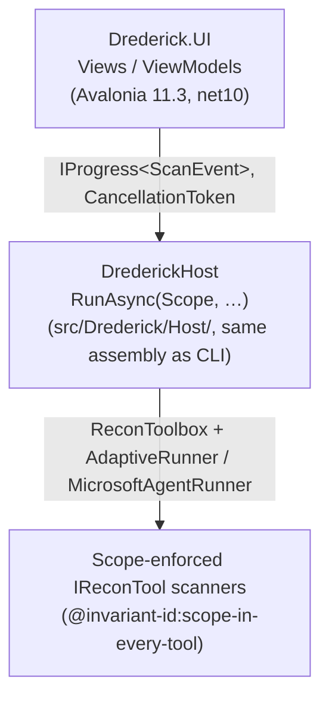

<!--
---
title: UI — Drederick operator console (Avalonia)
audience: [humans, agents]
primary: humans
stability: experimental
last_audited: 2026-05
related:
  - ../AGENTS.md
  - ../README.md
  - ARCHITECTURE.md
  - SCOPE_AND_LEGAL.md
  - DATASETTE.md
  - UI_GUIDE.md
---
-->

# UI — Drederick operator console

> **Status: experimental.** The Avalonia operator console is a live
> **recon** launcher plus enrichment/triage/notes surface. Post-run SQL
> triage still goes through [Datasette](DATASETTE.md); do not reimplement
> it here.
>
> **Current scope of this UI.** The console today drives recon, CVE/PoC
> enrichment, binary analysis, findings browsing, and the notes repo
> backed by `findings.db`. The offensive subsystem that landed in the
> engine (`ExploitRunner`, `CredRunner`, `PayloadStager`, `MsfDriver`)
> and the Jeopardy CTF subsystem are **not yet surfaced in this UI** —
> run them from the CLI. The doc describes what the XAML + view-models
> actually render, not an aspirational surface.

Drederick ships two operator-facing UIs that complement each other:

| Surface | Purpose | Lives in |
| ------- | ------- | -------- |
| **`Drederick.UI` (this doc)** | Live operator console: compose scope, pick targets, launch runs, watch progress. | `src/Drederick.UI/` |
| **Datasette (`drederick serve`)** | Post-run triage: SQL-queryable browsing of `out/findings.db`. | `datasette/metadata.json`, CLI `serve` subcommand |

<a id="quickstart"></a>
## Quickstart

```bash
# From the repo root (no packaging step required):
dotnet run --project src/Drederick.UI
```

Authorised targets only. Everything the CLI refuses, the UI refuses — the
scope check lives inside each recon tool, not at the UI boundary
(see [Invariants](#invariants)).

<a id="workflow"></a>
## Point-and-click workflow

1. **Scope tab**
   - Either **Browse…** to pick an existing scope file, **or** paste/edit
     CIDR entries directly in the inline editor — no file on disk required.
   - Toggle **Lab/CTF mode** and **Allow broad scope** with checkboxes.
   - Click **Re-parse** to validate; the parsed entry list fills in on the
     right. Any `ScopeException` (including the hard-coded wildcard
     refusal) renders as a red error banner.
   - Click **Save inline…** to persist the GUI-authored scope to a file for
     re-use.
2. **Run tab**
   - Type a target IP into **Add target** and click **Add**. The VM checks
     both that it's a valid IP and that it falls inside the loaded scope;
     out-of-scope or malformed targets are refused inline.
   - Click **Remove** on any target row to drop it.
   - Flip **Lab/CTF mode**, **Use agent runner** (needs `OPENAI_API_KEY`),
     or **Allow-broad**. Allow-broad surfaces a confirmation banner that
     must be explicitly clicked through before **Start scan** will enable.
   - Second row of checkboxes: **Annotate CVEs**, **Aggregate PoC refs**,
     **Cache PoC source**, **VPN preflight**, **Require VPN (abort if
     down)**. All default on (parity with CLI); toggling is per-run.
   - Set **Output dir** and **Memory** text boxes (defaults: `out`,
     `memory/findings.json`).
   - **Start scan** is disabled until the scope has validated *and* at
     least one target is in the list. Click it to run. **Cancel** aborts
     the in-flight run.
3. **Progress tab**
   - Live feed of `ScanEvent`s: timestamp, kind, target, tool, message.
     Phase-2 adds `VpnPreflight`, `CveAnnotated`, `PocAggregated` kinds so
     the operator can watch enrichment happen.
   - Status strip at the bottom shows `hosts:` / `tool calls:` counters and
     the latest error, if any.
4. **Doctor tab** *(phase 2)*
   - **Detect** scans PATH for all 24 tools in `DoctorRunner.Tools`
     (nmap, searchsploit, python3/2, go, ruby, git, datasette, netexec,
     impacket, hashcat, john, gobuster, ffuf, sqlmap, nuclei, kerbrute,
     seclists, evil-winrm, …) and displays Found/Version/Path per row.
   - Package-manager name (apt/dnf/pacman/zypper/brew) is displayed.
   - **Install missing** is gated behind an explicit consent checkbox.
     `@invariant-id:doctor-workstation-only`: drederick never re-execs as
     root; individual install recipes may prompt for sudo themselves, and
     the UI pipes the install transcript to `audit.jsonl`.
5. **Findings tab** *(phase 2)*
   - Read-only summary of `out/findings.db`: host / service / CVE / PoC-ref
     counts, plus a per-host row with open-port-count and service sample.
   - **Open in Datasette** launches our own `drederick serve` subcommand.
     This is the harness itself (not a scanner binary), and Datasette is
     read-only — triage stays with Datasette, per the plan's "don't
     reimplement triage" posture.
6. **Analyze tab** *(phase 3)*
   - Enter or **Browse…** to a local binary (ELF/PE/Mach-O).
   - Tick **Verbose** (shows all libs + strings) and/or **Save JSON report
     to output dir** (writes `out/<filename>.analysis.json`).
   - Click **Analyze**: runs `BinaryAnalyzer` on the thread pool, displays
     a text report (metadata, security posture, dependencies, strings,
     findings) on the left and a structured findings list on the right.
   - The binary is read only; it is never executed. A minimal local
     scope (`127.0.0.1/32`) satisfies `_scope.RequireFile(path)` since
     that check is file-existence only.
   - `ui.analyze.start` / `.finish` / `.error` / `.saved` audit events.
7. **Notes tab**
   - CRUD over the notes table inside `out/findings.db`
     (`NotesRepository`): title, content, tags, category
     (`note` / `flag` / `credential` / `exploit` / `screenshot` /
     `command`), and an optional flag-format string.
   - **Refresh** reloads the list; **New Note** clears the form;
     **Flags Only** filters to flagged rows; the search box runs a
     repository search.
   - The right-hand pane is a split create/edit form — select a row to
     edit, **Archive** / **Delete** / **Save**. The `credential` /
     `exploit` / `command` categories are *labels on operator-authored
     notes* (pentest journal entries); they do not execute anything.
   - Lazy-binds to `{OutputDir}/findings.db`; surfaces a "Run a scan
     first" message if the DB doesn't exist yet.
8. **Init tab** *(phase 3)*
   - A single scrollable form with four distinct sections, matching the
     steps of the CLI's `drederick init` wizard:
     - §1 **Verify operator tooling** — Detect button (read-only);
       results shown per-tool. Consent-required install lives in the Doctor
       tab (`@invariant-id:doctor-workstation-only`).
     - §2 **Credentials** — masked HTB API token + HTTP proxy fields;
       **Save credentials** writes `~/.drederick/config.json` with 0600
       permissions on Unix. The token value is stored in the file but
       never written to `audit.jsonl`.
     - §3 **Sample scope file** — **Create ~/scope.txt** button; skipped
       without error if the file already exists.
     - §4 **Quick start** — pre-formatted cheatsheet for copy/paste.
   - `ui.init.doctor_detect`, `ui.init.credentials_save`,
     `ui.init.create_scope` audit events.

<a id="architecture"></a>
## Architecture



### `DrederickHost` façade

`src/Drederick/Host/DrederickHost.cs` exposes two overloads:

- `RunAsync(RunOptions, IProgress<ScanEvent>?, CancellationToken)` —
  loads the scope from `RunOptions.ScopePath`. Used when the operator
  points the UI at an existing scope file.
- `RunAsync(Scope, RunOptions, IProgress<ScanEvent>?, CancellationToken)` —
  accepts an already-parsed `Scope`. This is the path the UI takes when the
  operator composes a scope entirely inside the inline editor — no temp
  file, no round-trip through disk. The `Scope` must have been produced by
  `ScopeLoader` (default-deny and wildcard refusal live there).

### `ScanEvent` stream

`ScanEvent` (also under `Host/`) is an append-only record surfaced to the UI
*in addition to* the append-only JSONL `AuditLog`. Kinds include
`SessionStart`, `ScopeLoaded`, `RunnerStart`, `HostFinished`,
`ReportWritten`, `SessionEnd`, and `Error`. The UI is free to drop or
batch; the audit log is always authoritative.

<a id="invariants"></a>
## Invariants preserved at the UI boundary

This is the non-negotiable bit. Every invariant the CLI honours, the UI
honours by construction:

| Invariant | UI expression |
| --------- | ------------- |
| `@invariant-id:scope-in-every-tool` | UI never spawns scanner or exploit binaries directly; every call goes through `DrederickHost` → `ReconToolbox` → scope-enforced `IReconTool`s. Every target typed into the Run tab is re-validated by `scope.Contains(...)` in `RunViewModel.AddTarget` *and* again inside each tool's `_scope.Require(target)`. |
| `@invariant-id:scope-default-deny`  | Start button disabled unless a scope is validated *and* at least one target is in the list (no file = no scope = no run). |
| `@invariant-id:scope-wildcard-refused` | Inline CIDR editor shows the raw `ScopeException` text when the operator pastes `0.0.0.0/0` or `::/0`; the refusal is not dismissable from the UI. |
| `@invariant-id:scope-prefix-cap`   | `Allow-broad` must be clicked *and* confirmed via a separate banner before Start will enable. |
| `@invariant-id:scope-file-read-only` | The Scope tab's **Save inline…** button writes a *new* file chosen by the operator; it never silently overwrites the loaded scope file. No code path in the UI writes back to the path in the **Scope file** text box. |
| `@invariant-id:llm-cannot-escape-scope` | When the "Use agent runner" checkbox is on, the agent routes through the same scope-enforced `AIFunction`s as the CLI. |
| **UI surface boundary** | The UI in this iteration exposes **recon + enrichment + binary analysis + findings/notes triage + doctor/init**. The offensive engine (`ExploitRunner`, `CredRunner`, `PayloadStager`, `MsfDriver`) and the Jeopardy CTF subsystem exist in the engine but are **CLI-driven today**. `UiAssemblyInvariantsTests` enforces that the UI source tree never directly spawns scanner/exploit binaries (`nmap`, `hydra`, `msfconsole`, `crackmapexec`, `responder`, `evil-winrm`, `impacket-*`, …) or `chmod +x` / anything under `poc_cache` — when exploitation lands in the UI, it will go through `DrederickHost` (which re-checks scope) and not by spawning binaries from the Avalonia process. |

<a id="first-iteration-scope"></a>
## Deferred to follow-ups

Explicitly not landing in this iteration:

- **Offensive surface in the UI.** The engine now ships
  `ExploitRunner`, `MsfDriver`, `CredRunner`, `PayloadStager`, and
  session tracking. The UI does not yet expose these — operators run
  them from the CLI with the per-category opt-in flags
  (`--allow-exec-pocs`, `--allow-cred-attacks`, `--allow-payloads`,
  `--allow-destructive`). When a UI surface lands it will go through
  `DrederickHost` and honour the same flags.
- **Jeopardy CTF subsystem in the UI.** Challenge browser / submission
  flow is CLI-only today.
- **UI packaging** (AppImage/MSI/DMG). `dotnet run --project src/Drederick.UI`
  is the supported entry point today; single-release consolidation (one
  artifact producing CLI + GUI) is a separate packaging effort.

Already landed in phase 2: **DoctorView**, **FindingsView** (with
"Open in Datasette"), and enrichment parity (CVE annotation, PoC
aggregation, VPN preflight) inside `DrederickHost.RunAsync`.

Already landed in phase 3: **AnalyzeView** (binary security analysis),
**InitView** (first-run setup wizard), and **NotesView** (CRUD over
`findings.db` notes table).

<a id="testing"></a>
## Testing

```bash
# Engine + CLI tests.
dotnet test tests/Drederick.Tests/Drederick.Tests.csproj

# UI ViewModel tests (pure CommunityToolkit.Mvvm, no Avalonia window).
dotnet test tests/Drederick.UI.Tests/Drederick.UI.Tests.csproj
```

The UI test project covers:

- `ScopeViewModelTests` — empty / wildcard-refused / valid-list / save-to-file.
- `RunViewModelTests` — Start-disabled invariants, Add/Remove, out-of-scope
  and non-IP refusals, Allow-broad confirmation gate.
- `DoctorViewModelTests` — install-consent-gating (install disabled before
  detect, without consent, or when nothing is missing; enabled only when
  all three are true).
- `FindingsViewModelTests` — `Reload` against missing / real `findings.db`.
- `AnalyzeViewModelTests` — CanAnalyze gating (empty/whitespace path,
  non-empty path, busy flag); file-not-found error surfaced in StatusLine;
  Findings collection starts empty.
- `InitViewModelTests` — credential save writes `config.json`; sample-scope
  creates `~/scope.txt`; skips if file already exists; `QuickStart` contains
  key commands; `GetConfigPath` contains `.drederick/config.json`.
- `NotesViewModelTests` — repository-missing status, create/update/delete,
  flag filtering, category validation.
- `UiAssemblyInvariantsTests` — source-tree scan refusing direct scanner
  / exploit binary spawns from the UI project (`nmap`, `hydra`,
  `msfconsole`, `crackmapexec`, `responder`, `impacket-GetUserSPNs`,
  `evil-winrm`, …) and `chmod +x` / `poc_cache` patterns. This is a
  UI-layer constraint — the *engine* may spawn these binaries via
  `ReconToolbox` / `ExploitToolbox` with scope re-checks; the UI
  process does not.

<a id="dependencies"></a>
## Dependency posture

The UI is **net10 native**: `Microsoft.Extensions.*` at **10.0.0**, not
bonsai's pinned 8.0.0. Avalonia 11.3.11 (net10-compatible),
`CommunityToolkit.Mvvm` 8.4.0. `Tmds.DBus.Protocol` is pinned to 0.21.3 to
close the transitive `GHSA-xrw6-gwf8-vvr9`.

Full versions live in
[`src/Drederick.UI/Drederick.UI.csproj`](../src/Drederick.UI/Drederick.UI.csproj).
